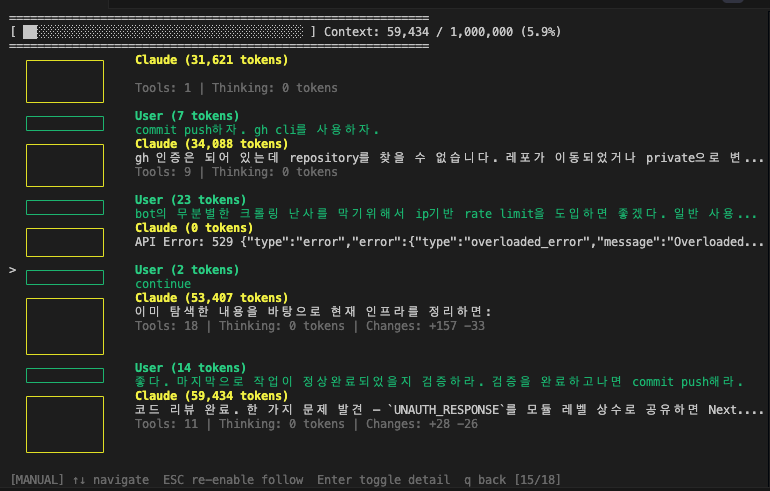

# Show me the Context

> Visualize your context window — for Claude Code



A terminal tool that shows you **how much of your context window is being used** in real time while using Claude Code.

## Why?

As conversations grow longer, Claude Code fills up the context window and starts summarizing (compacting) earlier messages. This can cause important context to be lost.

Run **Show me the Context** in a side terminal to:

- See what % of the context window is used at a glance
- Visually identify which blocks (System/User/Claude) consume the most tokens
- Track how many tools Claude called and which files were modified
- Auto-detect max context size per model (Opus 4.6: 1M, Sonnet: 200K, etc.)

## Install & Run

```bash
npm install -g show-me-the-context
```

```bash
show-me-the-context
```

On first launch, you'll be prompted to set up Claude Code hooks. Select **"Hook 설정 자동 추가"** and it's done automatically.

Then start `claude` in another terminal — it will be detected and visualized in real time.

## Controls

| Key     | Action                                |
| ------- | ------------------------------------- |
| `↑` `↓` | Navigate blocks                       |
| `Enter` | View block details                    |
| `ESC`   | Return to follow mode / close details |
| `q`     | Go back                               |

## License

MIT
