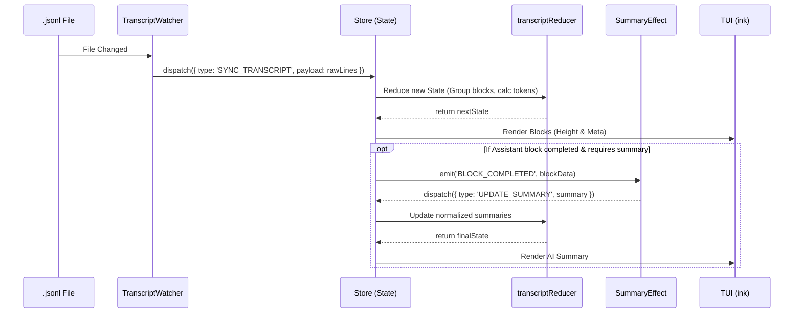

# 3. FLOW (데이터 및 유저 플로우)

### 3.1. User Flow (사용자 경험 플로우)

1. **CLI 실행:** 터미널에서 `claude-context-vis` 실행.
2. **Hook 설정 검사 (`HookManager`):**
   - 설정이 **없을 경우**: "Claude Code 이벤트 수신을 위한 Hook 설정이 누락되어 있습니다. 자동으로 추가할까요? (Y/n)" 프롬프트 노출.
   - `Y` 입력 시: 기존 `settings.json` 백업 후 HTTP 훅 구성 주입.
3. **로컬 서버 시작:** 백그라운드에서 Express 기반 Hook Server(포트 3456) 구동 및 수신 대기.
4. **Init UI 렌더링:** "Waiting for Claude Code..." 메시지와 함께 대기 화면(세션 선택 메뉴 포함) 노출.
5. **세션 진입 분기 (2-Way):**
   - **Case A (새로운 세션 대기):** 사용자가 다른 터미널에서 `claude`를 실행하여 Hook Server로 `SessionStart` 이벤트가 도달하면, 페이로드에서 `transcript_path`를 추출하고 즉시 메인 뷰(ContextVisScreen)로 자동 전환.
   - **Case B (이전 세션 불러오기):** 사용자가 대기 화면의 메뉴에서 '이전 세션 불러오기'를 선택하여 과거 파일(`.jsonl`) 목록 중 하나를 고르면, Hook 대기를 무시하고 선택된 파일로 메인 뷰 전환.
6. **Main View:** 선택된 세션의 컨텍스트 블록 렌더링.
   - `Follow Mode (Auto-scroll)`: 새 블록 생성 시 자동으로 포커스가 하단으로 이동.
   - `Navigation`: `↑/↓` 키 입력 시 Follow Mode가 해제되고 수동 포커싱. `ESC` 입력 시 Follow Mode 복귀.
   - `Detail View`: 블록에서 `Enter` 입력 시 해당 턴의 Raw JSON(Tool Call 상세 등) 조회 화면으로 전환.

### 3.2. Data Flow (단방향 상태 업데이트 플로우)

